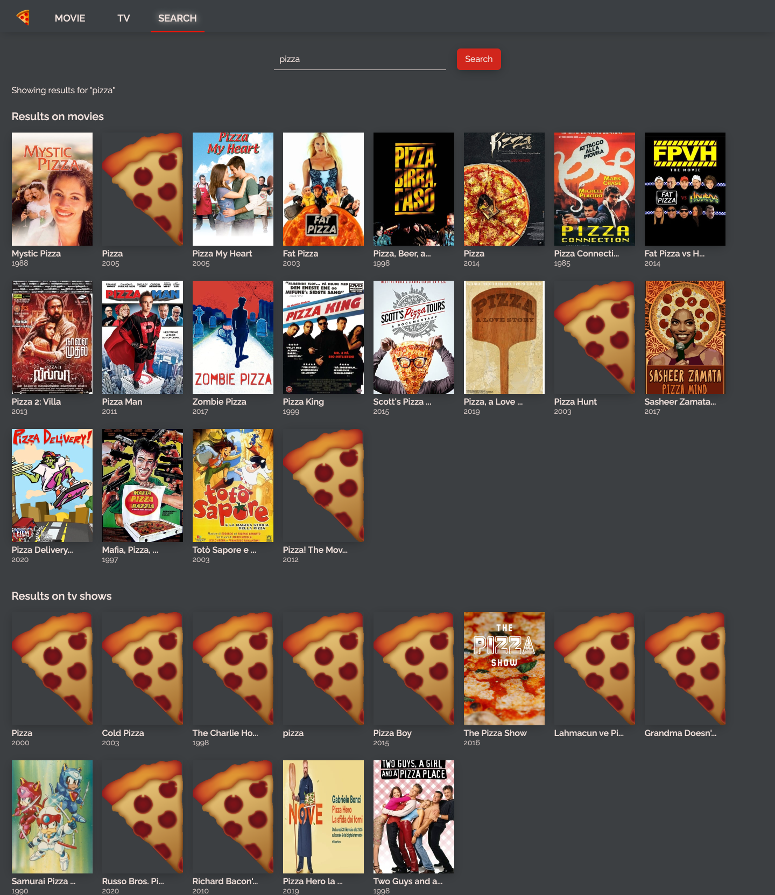

# Pizza time

## 🍕 🍻 🍕 🍻 🍕 🍻

## Creating a movie and tv show recommendation website to practice...

- ### React.js
- ### ES6
- ### styled-components

[github-pages](https://minapark127.github.io/pizza_time/#/)

### Sample pages

|                                   **Home**                                    |
| :---------------------------------------------------------------------------: |
|                     |
|                                  **Detail**                                   |
|                    |
|                                    **tv**                                     |
|                                |
|                                  **Search**                                   |
|                    |
|                                  **Mobile**                                   |
|               |
|                               **Mobile-movie**                                |
|  |
